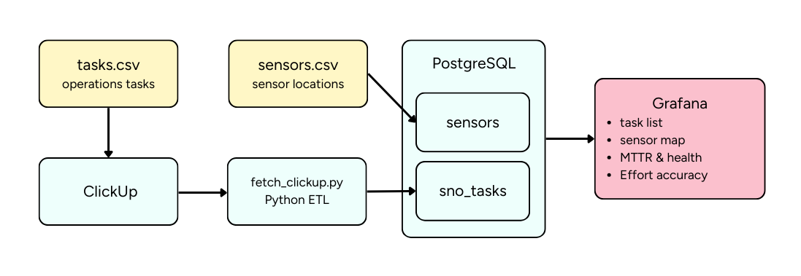
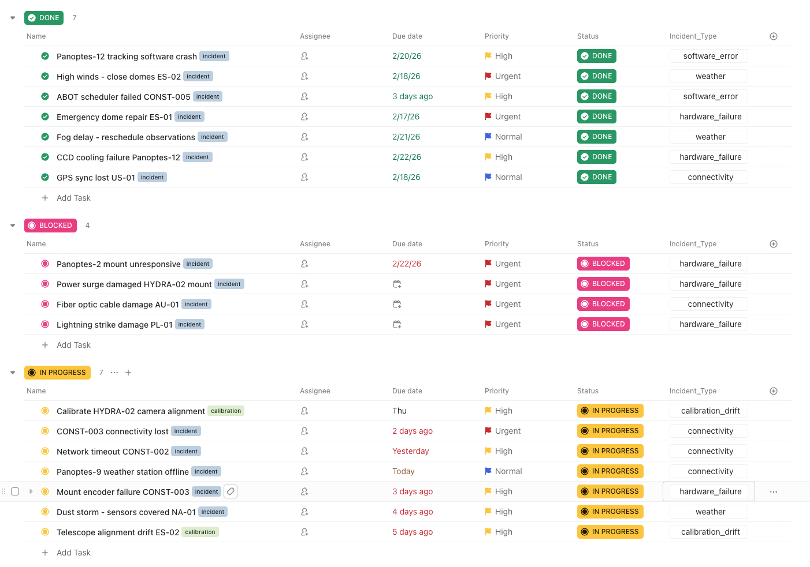
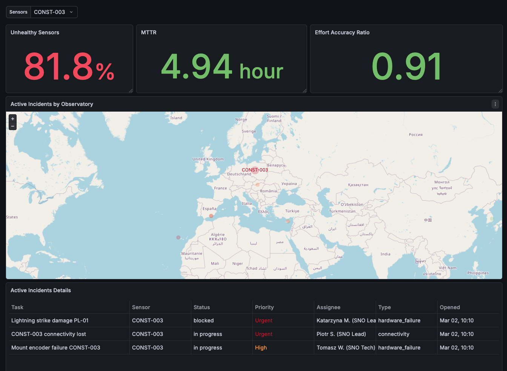

## Project overview

This project showcases an incident-monitoring dashboard for a company that operates ground‑based optical sensors (think small robotic telescopes) used to watch satellites and space debris. The business goal is simple: **give operations teams one clear view of everything that’s going wrong right now**, so they can decide what to fix first and understand how well they’re doing over time.

Each sensor can have open incidents (e.g. hardware issues, weather‑related downtime, tracking problems), and those are pulled in as tasks from ClickUp into a PostgreSQL database. The dashboard then shows **all active incidents with their priority**, along with a **map of observatories** where each sensor is color‑coded by the **highest‑priority open incident** affecting it. On top of the live status, the dashboard also tracks **MTTR (Mean Time To Repair)**, **percentage of unhealthy sensors**, and an **effort‑accuracy ratio** that compares estimated vs. actual time to resolve incidents. Together, these metrics let the team quickly spot critical outages, monitor network health, and continuously improve how accurately they plan and execute maintenance work.

## Architecture and data flow

The solution is built around a **PostgreSQL database**, a **ClickUp → PostgreSQL ETL script**, and a **Grafana dashboard** on top.



**Database layer**

- `sensors` stores the static description of each site: observatory_id, sensor identifier, human‑readable name, country, and lat / lon coordinates.
- `sno_tasks` stores operational incidents and maintenance work coming from ClickUp: task identifiers and names, status, priority, assignee_name, lifecycle timestamps (created_date, due_date, closed_date, updated_at), free‑form tags, and operational details such as incident_type, estimated_hours, and actual_hours.
- For query performance, indexes have been added on the sensor column in both `sensors` and `sno_tasks` tables to speed up joins and filters.

**ETL / integration layer**

- A Python script (fetch_clickup.py) connects to the ClickUp API using environment variables (list ID and API token).
- It fetches the tasks for the SNO Operations list, transforms them into the schema expected by sno_tasks (including status, priority, timestamps, and effort fields), and upserts them into PostgreSQL.

- This script can be run on a schedule (e.g. cron, CI, or an external scheduler) so that the database always reflects the current incident state in ClickUp.

**Analytics & visualization layer**

- Grafana is configured to use the PostgreSQL database as a data source.
- Panels query sensors and sno_tasks to power:
  - a live list of open incidents with priority and assignee,
  - a map of sensors with sensors color‑coded by the highest‑priority open incident,
  - time‑series and aggregate metrics such as MTTR, percentage of unhealthy sensors, and effort‑accuracy (estimated vs. actual hours).

### **Synthetic Data Generation**

To keep the project realistic, all records are **synthetic but business‑driven**:

- I started from what I know about the company’s business model and roughly where their sensors are deployed .
- Using that context, I used AI to generate observatory locations and incident‑like tasks that feel plausible for this kind of sensor network, while freely inventing details such as incident types, priorities, and repair times.
- The generated sensors were saved to CSV and imported into PostgreSQL, while the generated incident tasks were imported into ClickUp and then synced into the sno_tasks table via the fetch_clickup.py integration script.


## Grafana dashboard

The dashboard is built on top of the `sensors` and `sno_tasks` tables and is designed for **quick situational awareness**:

- **Unhealthy Sensors** – percentage of sensors with at least one non‑maintenance task that is not `done`.
- **MTTR** – average `actual_hours` to resolve non‑maintenance tasks that are `done`.
- **Effort Accuracy Ratio** – how close estimates are to reality: average actual hours divided by average estimated hours.
- **Sensor map** – geomap of sensors, colored by the highest‑priority open task per observatory (location).
- **Active tasks table** – list of open tasks for the selected sensor(s), sorted by priority.



### Dashboard variable

At the top there is a dropdown variable that controls the whole dashboard:

- **Name**: `selected_sensors`
- **Query**:
  ```sql
  SELECT DISTINCT sensor FROM sensors;
  ```
- **Behavior**: when a sensor (or sensors) is selected, the geomap highlights that sensor and the tasks table is filtered to only those tasks.

### Panels and queries

**Sensor map (geomap)**

Each observatory is shown once; color and label are based on the highest‑priority open task, and the selected sensor is visually emphasized:

```sql
WITH tasks_enriched AS (
  SELECT 
    sensor,
    observatory_id,
    priority,
    CASE
      WHEN priority = 'urgent' THEN 1
      WHEN priority = 'high' THEN 2
      ELSE 3  
    END AS priority_number
  FROM sno_tasks
  WHERE status != 'done' AND tags NOT LIKE '%maintenance%'
)
SELECT 
  s.sensor,
  s.name,
  s.lat, 
  s.lon, 
  CASE 
    WHEN min(t.priority_number) = 1 THEN 'Urgent'
    WHEN min(t.priority_number) = 2 THEN 'High'
    WHEN min(t.priority_number) = 3 THEN 'Normal'
    ELSE 'Healthy'
  END as priority_status,
  CASE 
    WHEN s.sensor IN (${selected_sensors:sqlstring}) THEN 10
    ELSE 5
  END AS marker_size,
  CASE 
    WHEN s.sensor IN (${selected_sensors:sqlstring}) THEN s.sensor
    ELSE ''
  END AS label
FROM sensors s
LEFT JOIN tasks_enriched t 
  ON s.sensor = t.sensor 
  AND s.observatory_id = t.observatory_id
GROUP BY s.sensor, s.name, s.lat, s.lon
```

**Active tasks table**

Shows the currently open (non‑maintenance) tasks for the selected sensor(s), with clear priority ordering:

```sql
SELECT 
  task_name AS "Task",
  sensor AS "Sensor",
  status AS "Status",
  priority AS "Priority",
  assignee_name AS "Assignee",
  incident_type AS "Type",
  TO_CHAR(created_date, 'Mon DD, HH24:MI') AS "Opened"
FROM sno_tasks
WHERE 
  sensor IN (${selected_sensors:sqlstring})
  AND status != 'done'
  AND tags NOT LIKE '%maintenance%'
ORDER BY 
  CASE priority 
    WHEN 'urgent' THEN 1 
    WHEN 'high' THEN 2 
    ELSE 3 
  END ASC;
```

**Unhealthy sensors (% card)**

Percentage of sensors that currently have at least one non‑maintenance task that is not done:

```sql
SELECT 
  COUNT(DISTINCT CASE WHEN t.tags NOT LIKE '%maintenance%' THEN s.sensor END) * 100.00 
  / COUNT(DISTINCT s.sensor) AS unhealthy_pct
FROM sensors s
LEFT JOIN sno_tasks t 
  ON s.sensor = t.sensor 
  AND t.status != 'done'
```

**MTTR (Mean Time To Repair)**

Average resolution time in hours, based on `actual_hours` for completed, non‑maintenance tasks:

```sql
SELECT 
  AVG(actual_hours) AS mttr_actual_hours
FROM sno_tasks 
WHERE status = 'done'
  AND tags NOT LIKE '%maintenance%'
  AND actual_hours IS NOT NULL 
  AND actual_hours > 0;
```

**Effort Accuracy Ratio**

How well estimates match reality (values close to `1.0` mean estimates are on point):

```sql
SELECT 
  ROUND(
    AVG(actual_hours) / NULLIF(AVG(estimated_hours), 0), 
    2
  ) AS effort_accuracy_ratio
FROM sno_tasks 
WHERE status = 'done'
  AND tags NOT LIKE '%maintenance%'
  AND actual_hours IS NOT NULL 
  AND estimated_hours IS NOT NULL
  AND estimated_hours > 0;
```

I also spot‑checked the dashboard against ClickUp to confirm that filtering, priorities, and counts in Grafana match the underlying task data.

## Initial data setup

Before running the ETL, populate the database and ClickUp with the provided synthetic data:

1. Import `data/sensors.csv` into the `sensors` table in PostgreSQL.
2. Import `data/clickup-tasks.csv` into your ClickUp list (the one referenced by `CLICKUP_LIST_ID`).
3. Copy `.env.example` to `sno.env` and place it at `~/code/secrets/`, then fill in your credentials and connection details.  
   Alternatively, keep it as `.env` in the project root and edit `fetch_clickup.py` to load from the correct path.


## Quick start

1. (Optional but recommended) Create and activate a virtual environment:
   ```bash
   python3 -m venv .venv
   source .venv/bin/activate 
   ```

2. Install dependencies:
   ```bash
   pip install -r requirements.txt
   ```

3. Configure environment variables in `.env` (copy from `.env.example` and fill in):
   - `CLICKUP_API_TOKEN`
   - `CLICKUP_LIST_ID`
   - `DB_HOST`
   - `DB_NAME`
   - `DB_USER`
   - `DB_PASSWORD`
   - `DB_PORT`

4. Run the ETL to sync tasks from ClickUp to PostgreSQL:
   ```bash
   python fetch_clickup.py
   ```

5. Open Grafana, add PostgreSQL as a data source pointing to the same database, and import the provided dashboard JSON from `grafana/sno-operations-dashboard.json` (Dashboards → New → Import → Upload JSON file).

## Tech stack

- Python 3.13.5
- PostgreSQL
- Grafana
- ClickUp REST API

## Limitations and future improvements
While this project provides a functional end-to-end pipeline, it is designed as a starting point. To move this into a production environment, the following improvements would be prioritized:

**Data Architecture & Scalability**
- **Transition to a Star Schema**: Currently, the data is relatively flat. As the dataset grows, moving to a Star Schema—with a central fact_incidents table and dimension tables for sensors, assignees, and priorities—will keep Grafana queries fast and make reporting more flexible.
- **Data Retention & Aggregates**: To handle years of data without slowing down the dashboard, I would implement a summary table for historical metrics (MTTR, effort accuracy) and keep the main table focused on recent and active incidents.
- **Pagination Support**: The ETL currently assumes a small incident list. For larger networks, ClickUp API pagination is required to ensure no tasks are missed during sync.


**Reliability & Data Integrity**
- **Handling New Sensors ("Graceful Degradation")**: To avoid orphaned records, the ETL should be updated to detect tasks for sensors not yet in the sensors table. These should be auto-provisioned as "Pending Location" placeholders so the incident remains visible while coordinates are being sourced.
- **Referential Integrity**: Future iterations should move from VARCHAR links to formal Foreign Key constraints between sno_tasks and sensors to prevent data mismatches.
- **Automated Testing**: Adding unit tests for the transform_task logic would ensure that changes to ClickUp's API or custom fields don't break the dashboard metrics.

**Automation & Monitoring**
- **Orchestration**: Moving the Python script from a manual run to a scheduled tool like Apache Airflow or a simple Cron job for continuous updates.
- **Standardized Filtering**: Replacing string-based SQL filters (e.g., LIKE %maintenance%) with specific ClickUp Category IDs to ensure the dashboard remains accurate even if a user renames a status or tag in the UI.